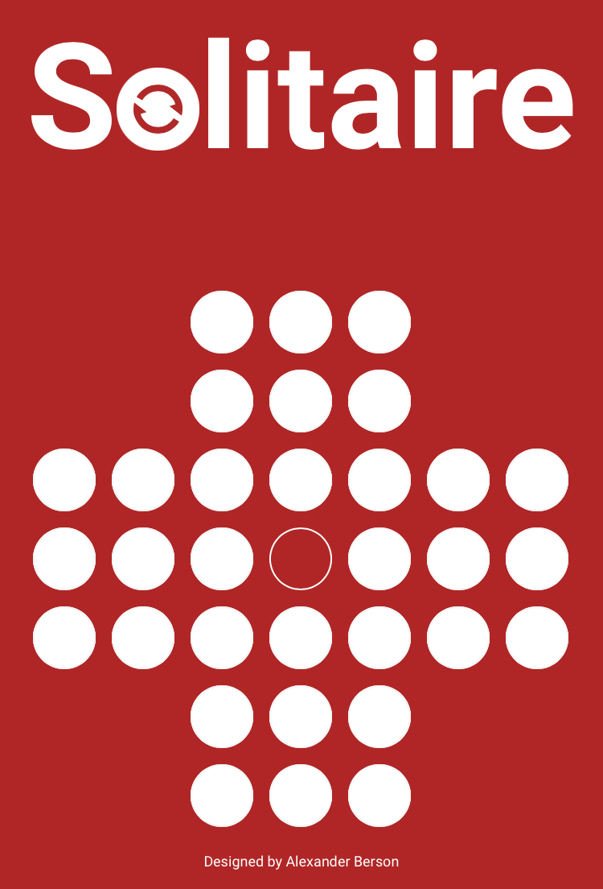

# Solitaire

Leave only one peg on the board.   
You can [play Solitaire online](https://alex-berson.github.io/solitaire/) or  

**SPOILER ALERT!** You can also [watch an AI solving Solitaire](https://alex-berson.github.io/solitaire/?mode=ai), as well as [learn an easy-to-remember solution](https://alex-berson.github.io/solitaire/?mode=easy).

## Description

**Solitaire**, also known as **Peg Solitaire**, is a single-player game played on a board with holes arranged in a cross pattern. At the start, pegs occupy all the holes except the center one.

The game involves jumping one peg over another into an empty hole, with jumps allowed only horizontally or vertically. The peg that is jumped over is removed from the board.

The objective is to clear the board of all pegs except one, ideally leaving it in the center hole, which is the inverse of the starting setup.

## Screenshot

  

## License

Copyright &copy; 2024 Alexander Berson. This project is licensed under the [MIT license](LICENSE.txt "MIT License").

